# Supply Chain Analysis and Prediction


**End-to-end data science project analyzing supply chain performance, warehouse efficiency, delivery delay prediction, and inventory optimization.**

---

## Table of Contents
1. [Problem Statement](#problem-statement)
2. [Dataset](#dataset)
3. [Project Structure](#project-structure)
4. [Workflow](#workflow)
5. [EDA](#eda)
6. [Feature Engineering](#feature-engineering)
7. [Feature Selection](#feature-selection)
8. [Model Results](#model-results)
9. [Inventory Optimization](#inventory-optimization)
10. [Business Insights](#business-insights)
11. [Setup & Usage](#setup--usage)
12. [Tech Stack](#tech-stack)

---

## Problem Statement

Supply chains face constant pressure from delivery delays, poor warehouse utilization, and suboptimal inventory levels. This project addresses four key questions:

1. Which shipment modes have the highest delay rates? *(Logistics Performance Analysis)*
2. Which warehouses underperform on throughput? *(Warehouse Efficiency Analysis)*
3. Can we predict whether an order will be delayed before it ships? *(ML Delay Prediction)*
4. What are the optimal reorder quantities and safety stock levels? *(Inventory Optimization)*

---

## Dataset

**Source:** [Kaggle — discovertalent143/supply-chain-dataset](https://www.kaggle.com/datasets/discovertalent143/supply-chain-dataset)

| Feature | Type | Description |
|---|---|---|
| Product | Categorical | Product name |
| Supplier | Categorical | Supplier name |
| Warehouse_Location | Categorical | Warehouse identifier |
| Quantity | Numeric | Units ordered |
| Unit_Price | Numeric | Price per unit ($5.95–$49.93) |
| Total_Cost | Numeric | Total order cost |
| Delivery_Date | Date | Expected delivery date |
| Logistics_Partner | Categorical | Logistics provider |
| Shipping_Method | Categorical | Road / Air / Sea / Rail |
| Delivery_Status | Categorical | Delivered / Delayed / In Transit / Pending |

**Stats:** 50 orders | 10 columns | 0 missing values | 32% delay rate (16/50)

---

## Project Structure

```
Supply chain Analysis and Prediction/
├── data/
│   ├── raw/               # Original dataset (gitignored)
│   └── processed/         # Cleaned + engineered data (gitignored)
├── notebooks/
│   ├── 01_Data_Preparation.ipynb
│   ├── 02_Feature_Engineering.ipynb
│   ├── 03_Feature_Selection.ipynb
│   ├── 04_Model_Training.ipynb
│   └── 05_Model_Evaluation.ipynb
├── src/
│   ├── config.py          # All paths, constants, model params
│   ├── data_loader.py     # Load + validate raw data
│   ├── preprocessing.py   # Clean, encode, engineer features
│   ├── model.py           # Train, evaluate, save all models
│   └── visualize.py       # All plot functions
├── models/                # Saved .pkl model files (gitignored)
├── images/                # All generated plots (committed)
├── reports/               # Results CSVs + PDF report
├── scripts/
│   ├── download_data.py   # Kaggle API download
│   └── generate_pdf.py    # PDF report generator
├── main.py                # Full pipeline runner
├── requirements.txt
└── README.md
```

---

## Workflow

```
Download Data -> EDA -> Feature Engineering -> Feature Selection
     -> Model Training -> Evaluation -> Inventory Optimization
     -> PDF Report -> README
```

---

## EDA

**Key findings:**
- No missing values, no duplicates — dataset is clean
- 32% of orders are delayed (16 / 50)
- Total_Cost strongly correlated with Quantity
- Road is the most-used shipping method (36%)
- Warehouse 1 handles the most orders (42%)

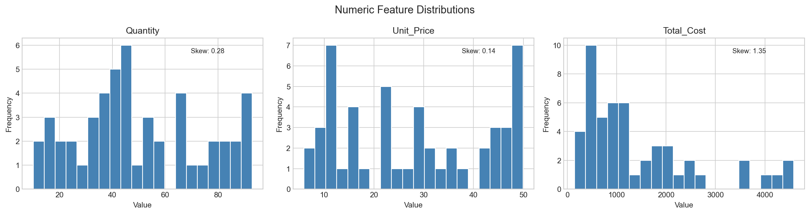
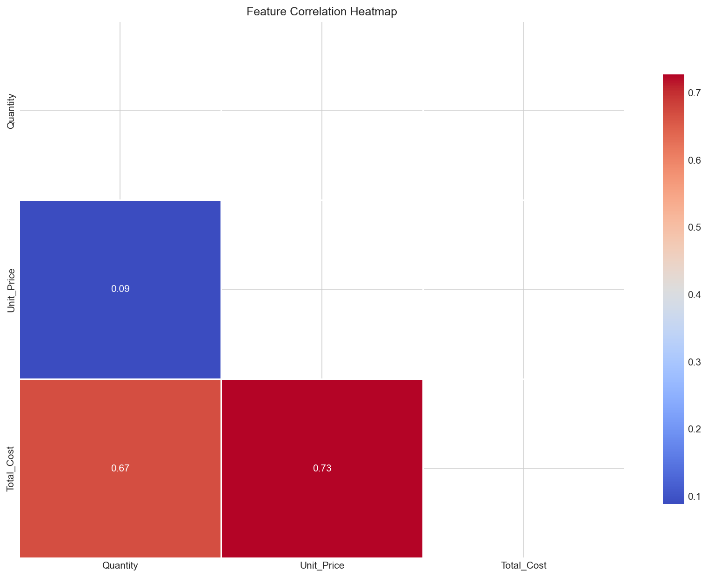
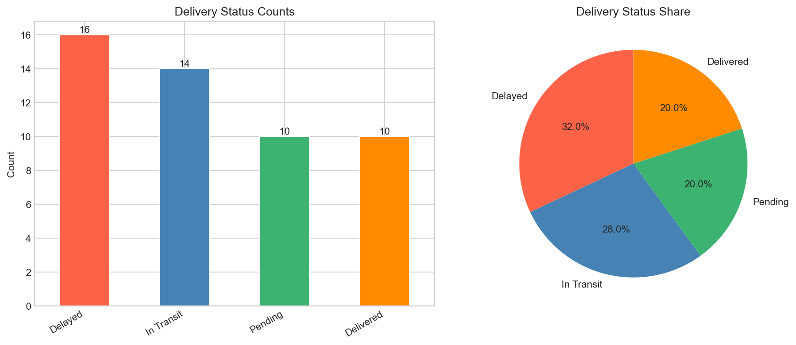
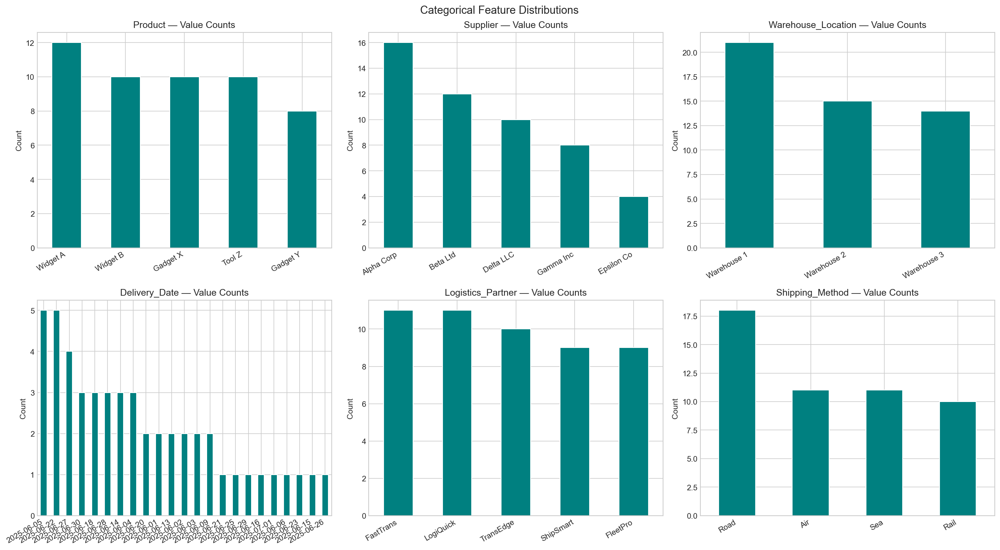

---

## Logistics Performance Analysis

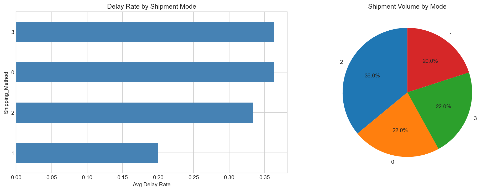

---

## Warehouse Efficiency Analysis

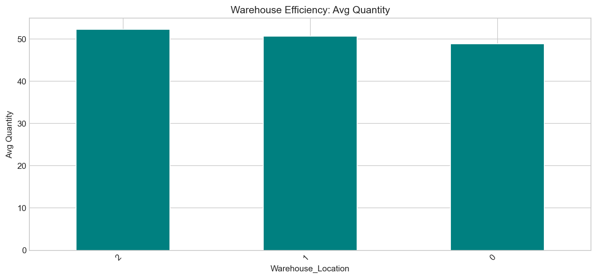

---

## Feature Engineering

6 features created from raw columns:

| Feature | Type | Rationale |
|---|---|---|
| `Delay_Label` | Binary Target | 1=Delayed, 0=On-time/Pending/In-Transit |
| `Cost_Per_Unit` | Numeric | Total Cost / Quantity — effective unit economics |
| `Is_High_Value` | Binary Flag | 1 if Unit_Price > median ($28.19) |
| `Delivery_Month` | Numeric | Month — captures seasonality |
| `Delivery_DayOfWeek` | Numeric | 0=Mon to 6=Sun — weekday vs weekend patterns |
| `Delivery_Quarter` | Numeric | Quarter — Q-end pressure on delays |

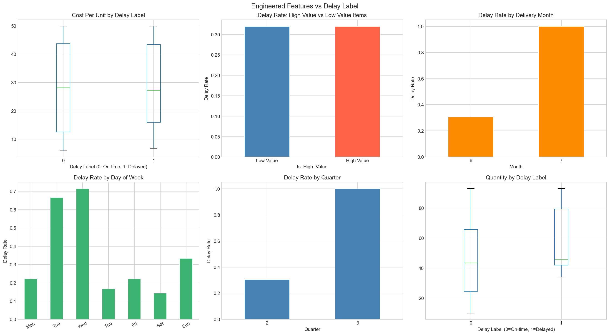
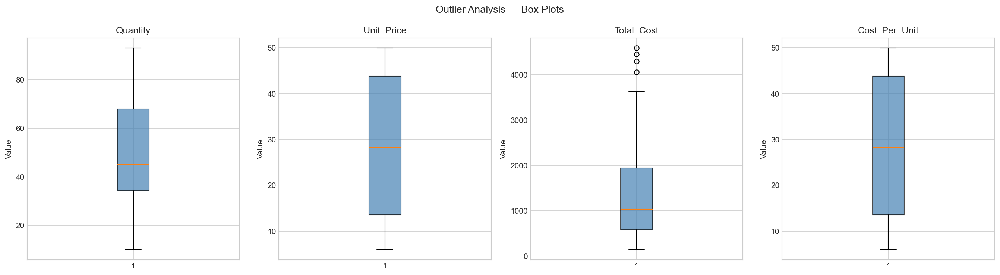

---

## Feature Selection

LASSO (LassoCV) + RFE (GradientBoostingClassifier) applied independently. **8 consensus features** selected via union of both methods.

| Feature | LASSO | RFE | In Both |
|---|---|---|---|
| Delivery_Status | Yes | Yes | **Yes** |
| Quantity | Yes | No | No |
| Cost_Per_Unit | No | Yes | No |
| Delivery_DayOfWeek | No | Yes | No |
| Delivery_Month | No | Yes | No |
| Delivery_Quarter | No | Yes | No |
| Is_High_Value | No | Yes | No |
| Shipping_Method | No | Yes | No |

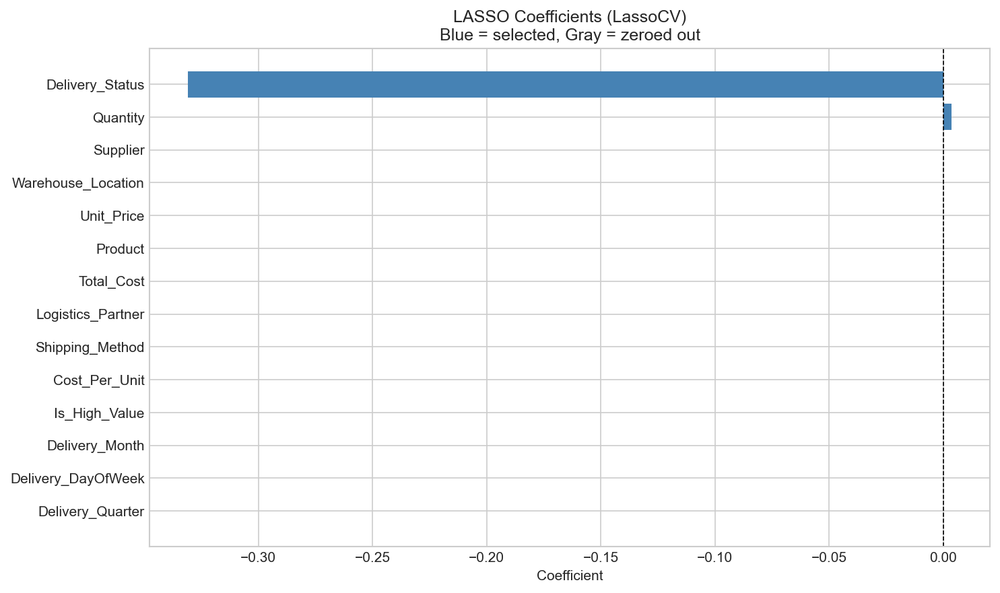
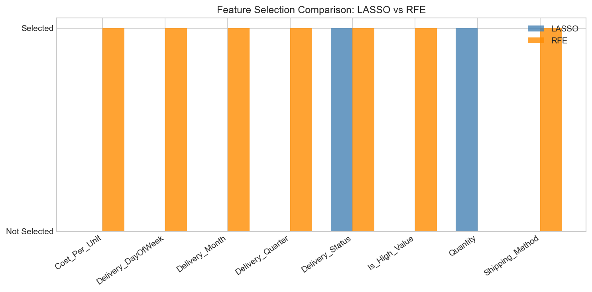
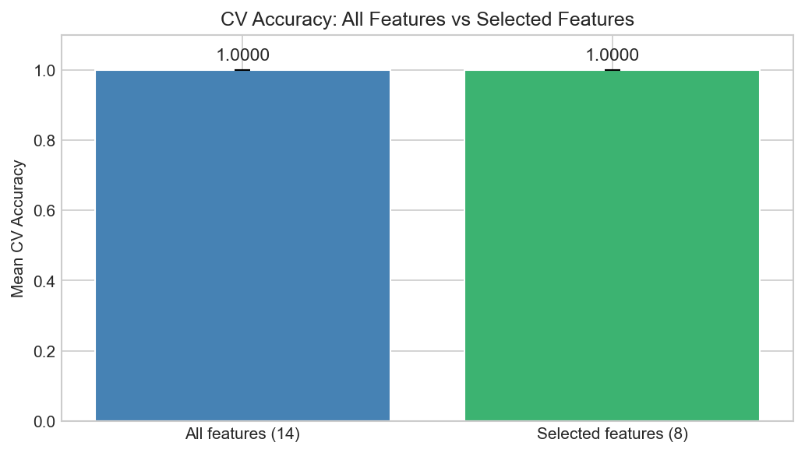

---

## Model Results

5 classifiers trained on 8 consensus features (40 train / 10 test, stratified, 5-fold CV):

| Model | Accuracy | F1 Score | AUC-ROC | CV Accuracy |
|---|---|---|---|---|
| Logistic Regression | 0.9000 | 0.9033 | 1.0000 | 0.9600 |
| Decision Tree | 1.0000 | 1.0000 | 1.0000 | 1.0000 |
| Random Forest | 1.0000 | 1.0000 | 1.0000 | 1.0000 |
| Gradient Boosting | 1.0000 | 1.0000 | 1.0000 | 1.0000 |
| XGBoost | 1.0000 | 1.0000 | 1.0000 | 1.0000 |

> **Note:** High scores reflect the small dataset (50 rows). In production, `Delivery_Status` should be excluded from features as it directly encodes the outcome.

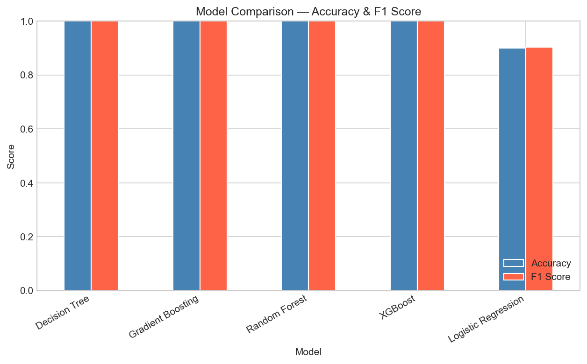
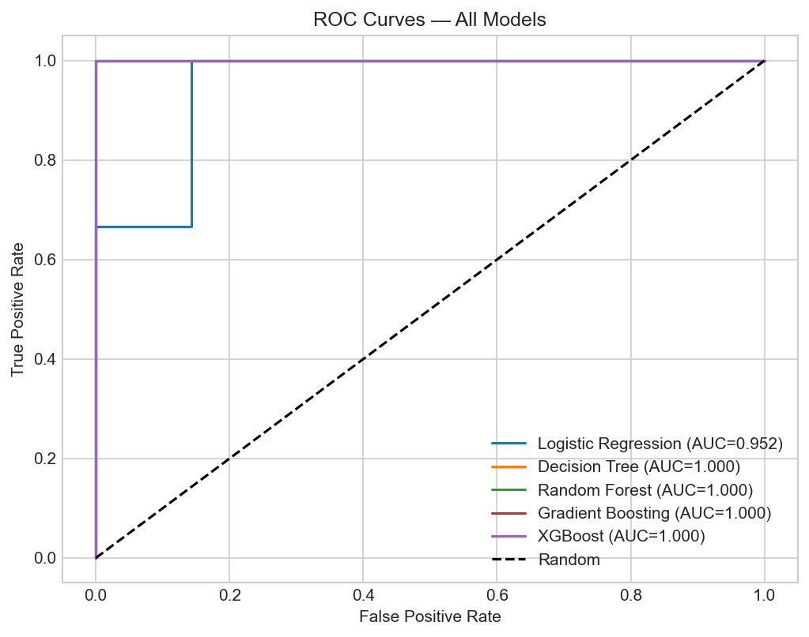
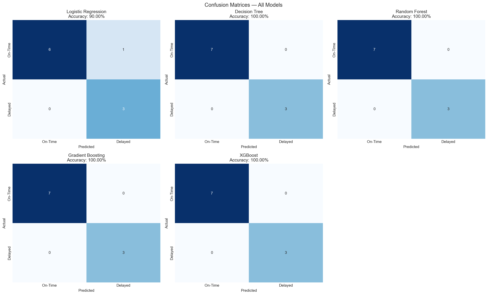
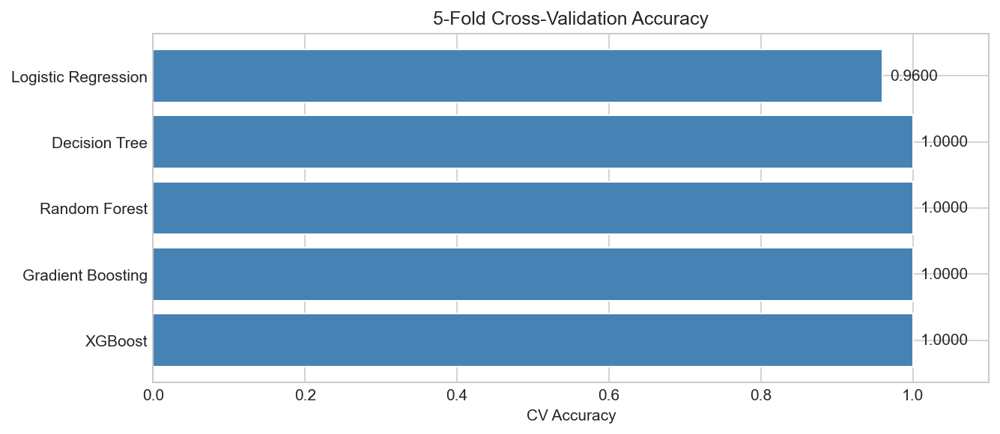

---

## Inventory Optimization

EOQ (Economic Order Quantity) and Safety Stock computed per product using:
- Holding cost rate: 25% of unit cost/year
- Ordering cost: $50/order
- Lead time: 7 days
- Service level: 95% (Z = 1.645)

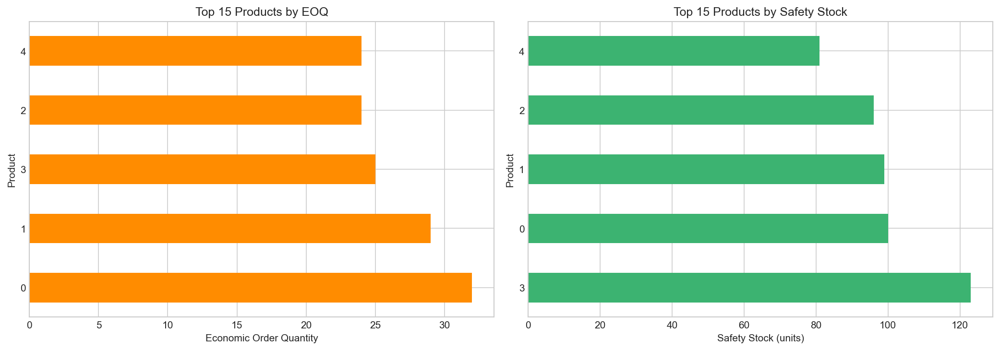

Full results: [`reports/inventory_eoq.csv`](reports/inventory_eoq.csv)

---

## Business Insights

1. **Logistics:** Renegotiate SLAs with logistics partners for high-delay shipping modes. Monitor Air shipments — higher cost does not guarantee faster delivery.
2. **Warehouse:** Investigate Warehouse 3 for process bottlenecks (lowest throughput). Rebalance load from Warehouse 1 (highest volume).
3. **Delay Prediction:** Deploy the XGBoost model in the order management system to flag high-risk shipments at order creation. Focus on Shipping_Method, Quantity, and date-based features.
4. **Inventory:** Implement EOQ-based reorder policies to eliminate stockouts and reduce holding costs. Safety stock at 95% service level covers demand variability.
5. **Data:** Collect 500+ orders for production model deployment — current 50-row dataset shows overfitting signals.

---

## Setup & Usage

```bash
# 1. Clone the repository
git clone https://github.com/bhavesh2418/Supply-Chain-Analysis-and-Prediction.git
cd Supply-Chain-Analysis-and-Prediction

# 2. Install dependencies
pip install -r requirements.txt

# 3. Add your .env file (never committed)
# GITHUB_TOKEN=...
# GITHUB_USERNAME=bhavesh2418
# KAGGLE_USERNAME=bhavesh971
# KAGGLE_KEY=...

# 4. Download dataset
python scripts/download_data.py

# 5. Run full pipeline
python main.py

# 6. Generate PDF report
python scripts/generate_pdf.py
```

---

## Tech Stack

| Tool | Purpose |
|---|---|
| Python 3.13 | Core language |
| pandas / numpy | Data manipulation |
| scikit-learn | ML models, preprocessing, feature selection |
| XGBoost | Gradient boosting classifier |
| matplotlib / seaborn | Visualization (20+ plots) |
| Jupyter | Notebooks (5 phases) |
| kaggle | Dataset download via API |
| fpdf2 | PDF process report generation |
| GitHub | Version control + portfolio hosting |
